# Secure P2P Encrypted Chat

A modular, terminal-based peer-to-peer chat app that starts simple (plaintext) and can upgrade to a secure session using modern cryptography.

It is designed to be educational **and** practical:
- clear command-driven workflow,
- explicit protocol messages you can inspect,
- security checks for confidentiality, integrity, authenticity, and freshness.

---

## Table of Contents

- [What this project does](#what-this-project-does)
- [Project goals checklist](#project-goals-checklist)
- [Repository layout](#repository-layout)
- [Security explained from first principles](#security-explained-from-first-principles)
- [High-level system architecture](#high-level-system-architecture)
- [Runtime program flow](#runtime-program-flow)
- [Protocol message model](#protocol-message-model)
- [Key exchange sequence](#key-exchange-sequence)
- [Network packet flow by phase](#network-packet-flow-by-phase)
- [Security-property mapping](#security-property-mapping)
- [Requirements](#requirements)
- [Run (`Code/main.py`)](#run-codemainpy)
- [Command guide](#command-guide)
- [Operation walkthrough](#operation-walkthrough)
- [Screenshots and packet captures](#screenshots-and-packet-captures)
- [References and resources](#references-and-resources)

---

## What this project does

Two peers connect directly over TCP and chat in the terminal.

- Before key sharing, messages use `PLAIN_CHAT`.
- After secure setup (`/share`), messages use `SEC_CHAT` encrypted with AES-256-GCM.
- Rekeying (`/rekey`) rotates to a fresh session key using the same secure handshake.

The implementation is aligned with:
- `Code/main.py` (runtime + state machine + command handling),
- `Code/crypto.py` (RSA/AES operations),
- `Code/protocol.py` (envelope encoding/decoding + freshness checks),
- `Code/ui.py` (terminal UX).

---

## Project goals checklist

This implementation follows the required end-to-end sequence:

- [x] **i. Launch two client instances** (same machine or separate machines).
- [x] **ii. Provide peer addressing and establish transport connectivity** (TCP).
- [x] **iii. Exchange plaintext messages** before key sharing.
- [x] **iv. Trigger command-based public-key exchange** (`/sendpub`) with key generation when needed.
- [x] **v. Trigger command-based shared-key exchange** (`/share`) with confidentiality, integrity/authenticity, and freshness checks.
- [x] **vi. Exchange encrypted messages** after keys are established.

---

## Repository layout

| Path | Responsibility |
|---|---|
| `Code/main.py` | App entrypoint, socket setup (`listen`/`connect`), `SecureChatClient` state machine, command handling, message dispatch. |
| `Code/crypto.py` | RSA-2048 key generation, RSA-OAEP encrypt/decrypt, RSA-PSS sign/verify, AES-256-GCM encrypt/decrypt. |
| `Code/protocol.py` | Newline-delimited JSON envelope format, base64 helpers, canonical payload serialization, timestamp freshness checks. |
| `Code/ui.py` | Colored console output and editable command input (`prompt_toolkit`). |
| `Code/assets/` | Screenshots used in the README (terminal views + packet captures). |

---

## Security explained from first principles

Think of secure chat as answering four simple questions:

1. **Confidentiality** — can outsiders read the message?
2. **Integrity** — was the message altered in transit?
3. **Authenticity** — did it really come from the peer we expect?
4. **Freshness** — is this new data, not an old replay?

This project answers those with a layered design:
- RSA helps safely move the shared session key.
- AES-GCM protects message contents and detects tampering.
- Signatures and fingerprint checks help verify identity.
- Nonces, timestamps, and sequence counters prevent replay/stale data acceptance.

---

## High-level system architecture

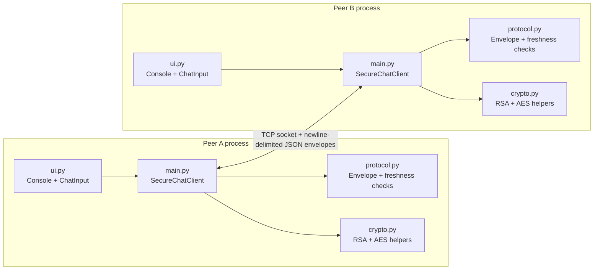

---

## Runtime program flow

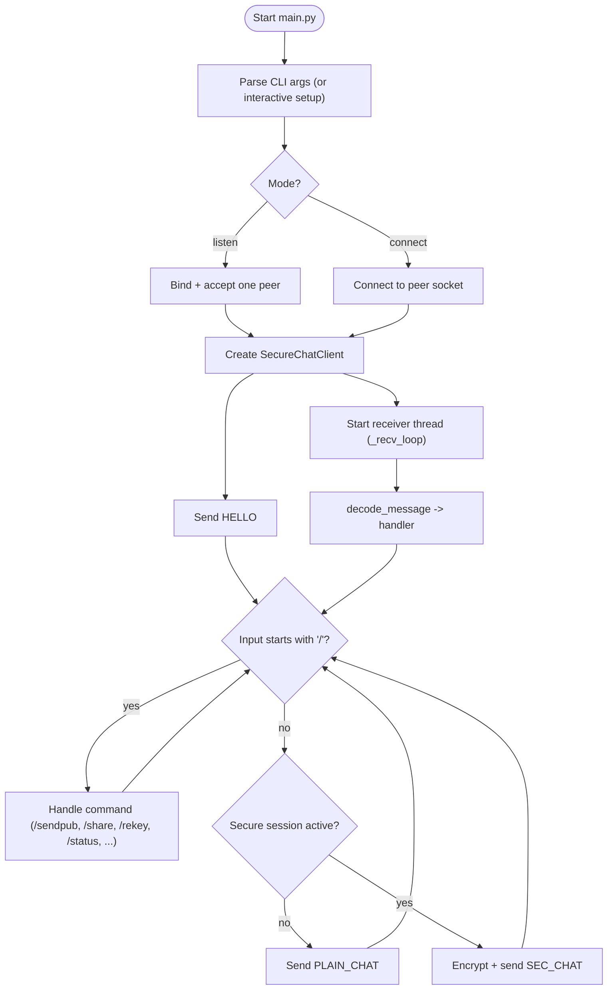

---

## Protocol message model

Each network packet is one JSON envelope line (`\n` delimited):

```json
{"v":1,"type":"SEC_CHAT","payload":{"sender":"Alice","ts":1730000000,"key_id":"ab12cd34ef56...","blob":"..."}}
```

Implemented in `protocol.py`:
- `encode_message(...)` writes compact JSON + newline,
- `decode_message(...)` validates version/type/payload shape,
- `is_fresh(...)` enforces timestamp freshness window (`MAX_CLOCK_SKEW_SECONDS = 180`).

Key message types in `main.py`:
- control/identity: `HELLO`, `NICK_UPDATE`, `PUBKEY`
- key setup: `KEY_REQ`, `KEY_CHALLENGE`, `KEY_SET`, `KEY_ACK`
- chat: `PLAIN_CHAT`, `SEC_CHAT`

---

## Key exchange sequence

The secure-session handshake is command-driven (`/share` or `/rekey`) and uses challenge/response checks.

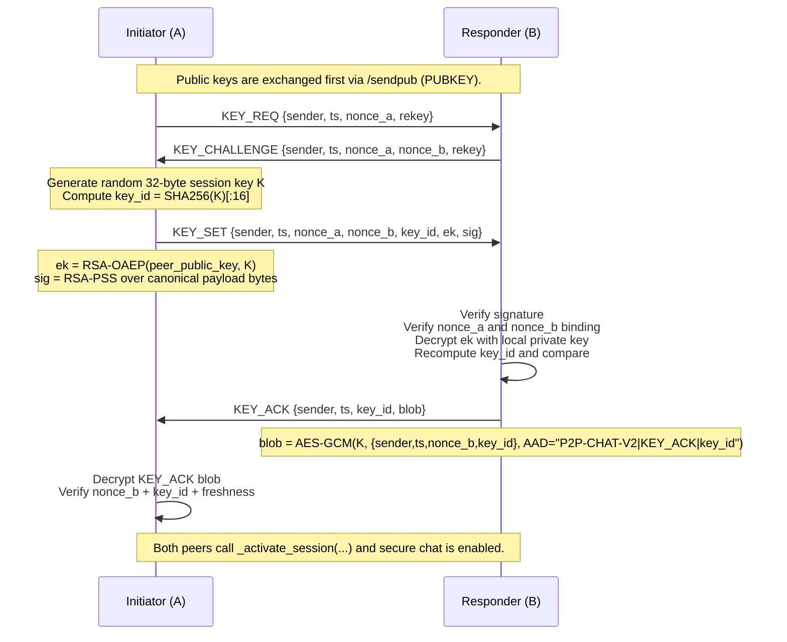

---

## Network packet flow by phase

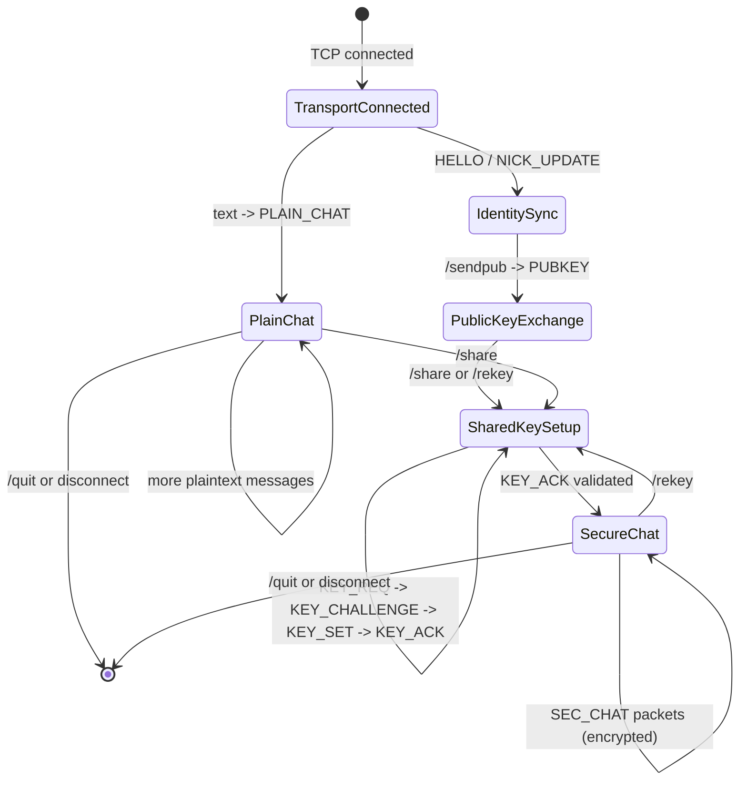

---

## Security-property mapping

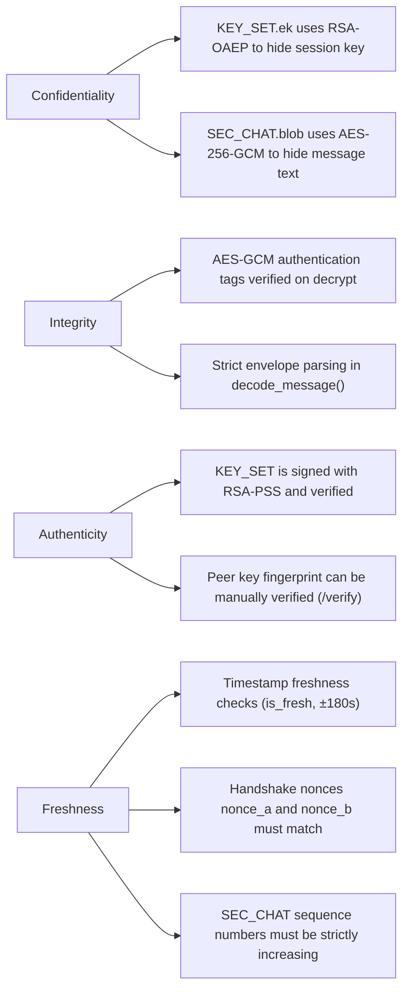

Practical meaning:
- Attackers should not be able to read secure messages.
- Tampered packets fail cryptographic checks and are rejected.
- Replay/stale packets are filtered by time windows, nonce matching, and sequence checks.

---

## Requirements

- Python **3.13**
- Packages:
  - `pycryptodome`
  - `prompt_toolkit`

Install dependencies:

### Windows

```powershell
py -3.13 -m pip install --upgrade pip
py -3.13 -m pip install pycryptodome prompt_toolkit
```

### Linux/macOS

```bash
python3 -m pip install --upgrade pip
python3 -m pip install pycryptodome prompt_toolkit
```

---

## Run (`Code/main.py`)

Open two terminals in the repository root.

### Terminal A (listener)

```bash
python3 Code/main.py listen 5000 --nick Alice
```

### Terminal B (connector)

```bash
python3 Code/main.py connect 127.0.0.1 5000 --nick Bob
```

### Interactive setup mode (optional)

```bash
python3 Code/main.py
```

If no mode is passed, the app prompts for **Listen** or **Connect**, then asks for host/port as needed.

---

## Command guide

### Session/utility commands

| Command | Description |
|---|---|
| `/help` | Print available commands and input tips. |
| `/status` | Show peer info, message counters (sent/received), and session summary. |
| `/showsession` | Show detailed session state: key presence, handshake role (A/B), pending nonce state, and sequence counters. |
| `/history [count]` | Show recent chat records (default `20`). |
| `/quit` | Exit the chat session. |

### Identity and key commands

| Command | Description |
|---|---|
| `/genkeys` | Generate local RSA-2048 key pair. |
| `/sendpub` | Send local public key to peer; peer auto-replies once. |
| `/showkeys` | Show full PEM of local and peer public keys plus their fingerprints. |
| `/verify [fingerprint]` | Mark peer key as verified (optional explicit fingerprint check). |

### Secure session commands

| Command | Description |
|---|---|
| `/share` | Initiate shared-session key negotiation. |
| `/rekey` | Rotate to a new session key using the same secure flow. |

### Profile command

| Command | Description |
|---|---|
| `/nick <new_name>` | Update local nickname and notify peer. |

### Message behavior

- Plain text input (no `/`) sends a chat message.
- Before secure setup: sent as `PLAIN_CHAT`.
- After secure setup: sent as encrypted `SEC_CHAT`.

---

## Operation walkthrough

**Step 1 — Start both peers**

```bash
# Terminal A (listener)
python3 Code/main.py listen 5000 --nick Alice

# Terminal B (connector)
python3 Code/main.py connect 127.0.0.1 5000 --nick Bob
```

**Step 2 — Send a plaintext message** (before any key setup)

Just type a message and press Enter. It is sent as `PLAIN_CHAT`.

**Step 3 — Generate local RSA keys** (on both sides if not yet done)

```
/genkeys
```

**Step 4 — (Optional) View your public key**

```
/showkeys
```

Shows your full PEM and fingerprint. No peer key is shown yet.

**Step 5 — Exchange public keys**

```
/sendpub
```

Your peer will auto-reply with their key once. After this, `/showkeys` shows both sides.

**Step 6 — (Optional) Verify peer fingerprint out-of-band**

Compare fingerprints over a side channel (phone call, Signal, etc.), then:

```
/verify <fingerprint>
```

**Step 7 — Establish a secure session**

```
/share
```

Triggers `KEY_REQ` → `KEY_CHALLENGE` → `KEY_SET` → `KEY_ACK`. Text you type after this is sent as encrypted `SEC_CHAT`.

**Step 8 — (Optional) Inspect detailed session state**

```
/showsession
```

Shows session key presence, your handshake role (A/B), pending nonce state, and sequence counters.

**Step 9 — Rotate the session key at any time**

```
/rekey
```

**Step 10 — Exit**

```
/quit
```

---

## Screenshots and packet captures

### 1) Setup view

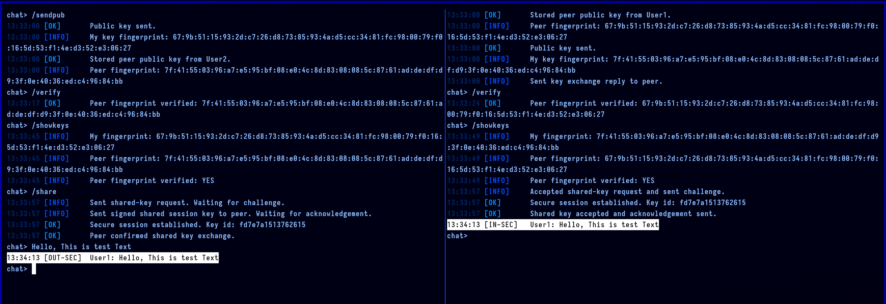

### 2) Plaintext packet capture

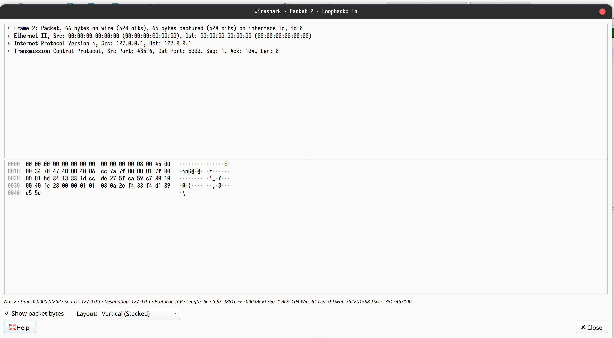

### 3) Encrypted packet capture

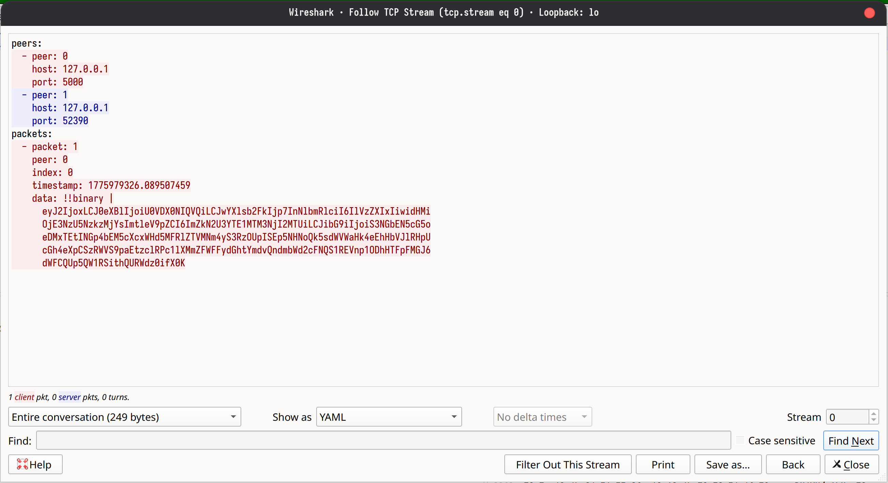

### 4) Key exchange status (side by side)

| Key exchange progression | Secure session view |
|---|---|
| 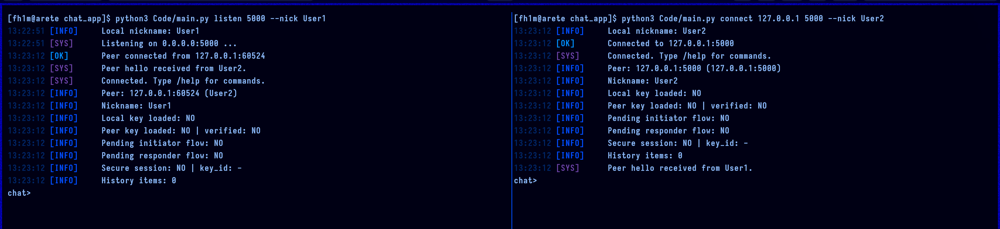 |  |

### 5) Wireshark: cleartext vs secure (side by side)

| Wireshark cleartext | Wireshark encrypted |
|---|---|
| 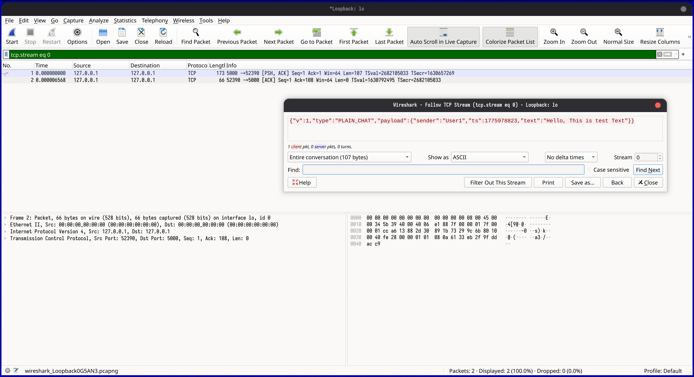 | 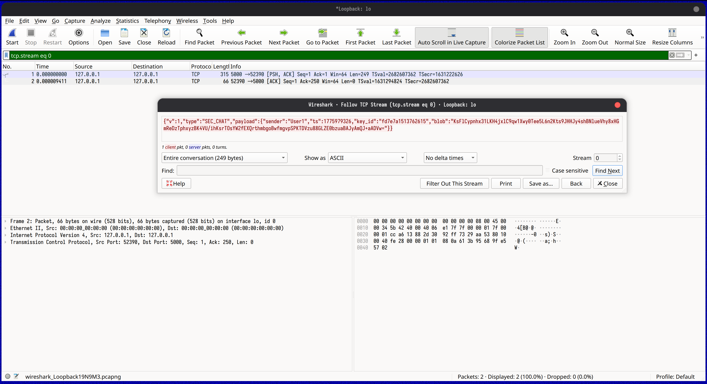 |

---

## References and resources

- [PyCryptodome Documentation](https://pycryptodome.readthedocs.io/)
- [prompt_toolkit Documentation](https://python-prompt-toolkit.readthedocs.io/)
- [Python `socket` module docs](https://docs.python.org/3/library/socket.html)
- [Wireshark](https://www.wireshark.org/)
- [Cisco Packet Tracer](https://www.netacad.com/about-networking-academy/packet-tracer/)
